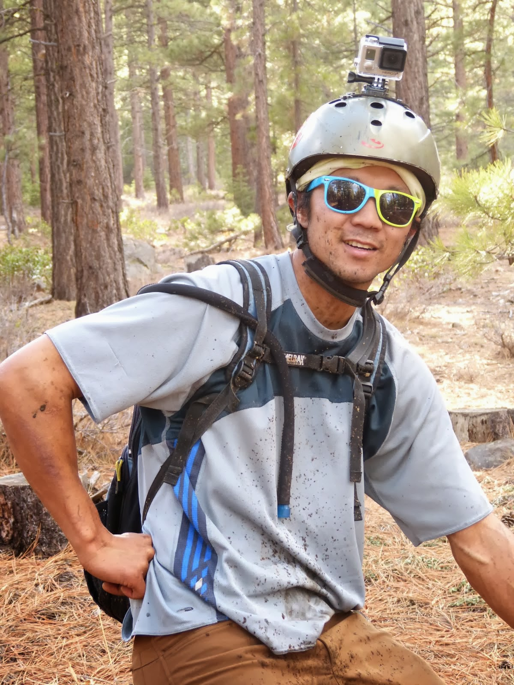
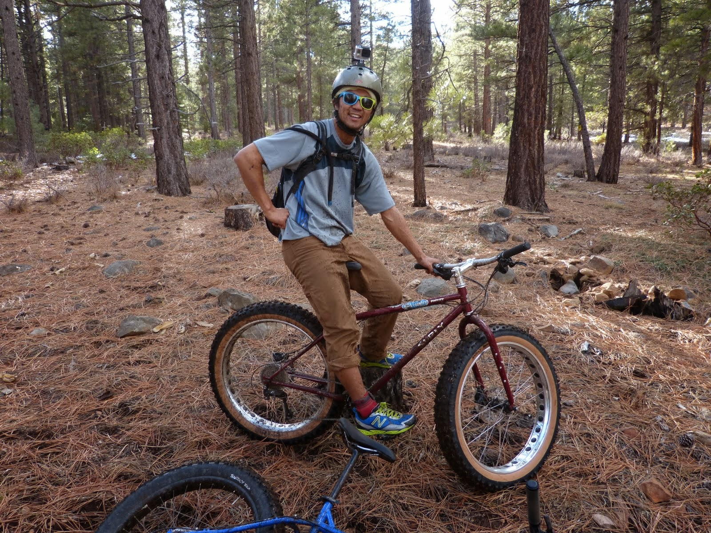

# BIG Bikes with Yu

*Published: February 21, 2014*

*Original URL: [https://gorunamountain.blogspot.com/2014/02/big-bikes-with-yu.html](https://gorunamountain.blogspot.com/2014/02/big-bikes-with-yu.html)*

---

Today Yu and I rented some BIG BIKES and had fun playing with the little snow we have up here in Tahoe. These things have no suspensions, are really heavy and I have to say, really fun to ride. Best for down-hill. Keeping things on track is a little more challenging at the beginning as the inertia is so BIG. We took the Historic Emigrant Trail. Traction on the back wheel is not a problem, it is sooo wide.  We only had fun till Yu got himself a pinch flat. BUMMER.What a fun afternoon.Stefan

  **
******
