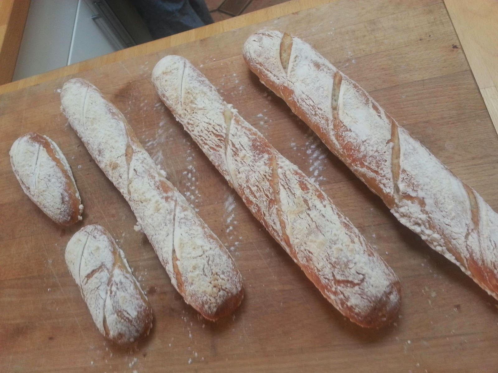
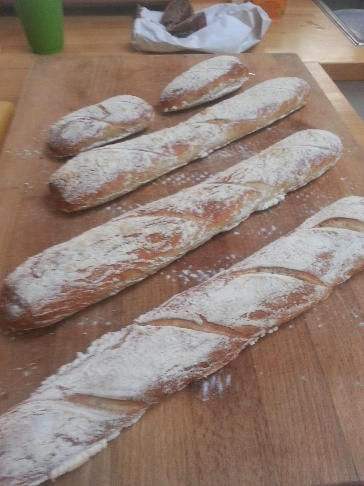

# Baguette trial#8

*Published: May 04, 2014*

*Original URL: [https://gorunamountain.blogspot.com/2014/05/baguette-trial8.html](https://gorunamountain.blogspot.com/2014/05/baguette-trial8.html)*

---

One more trial on the baguette front. This time I set the rack one step lower, and all is done after 13 minutes@ 550F.

I am getting a little better at shaping, but could really use some advise from experienced bakers and shapers. How do I get them to be a little more uniform? Can anyone tell me?

Anyway, I am glad this batch worked out well as tonight the master baker de anne, comes with laurel. I will await her judgement.

 

  

 

